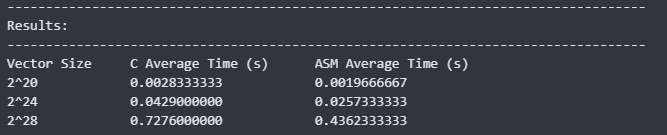
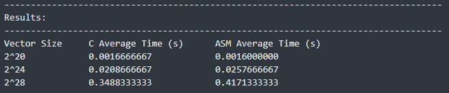
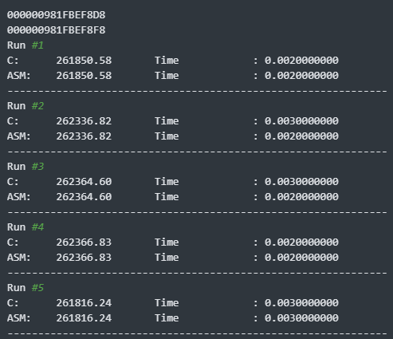

<header>This project was made in Visual Studio following Sir Roger's Video on how to set up Visual Studio 2022 for C and ASM.</header>

# 1. Comparative execution time and short analysis of the performance of the kernels
## 1.1 Execution Time Results (Debug Mode)


## 1.2 Execution Time Results (Release Mode)


## 1.3 Analysis of the performance of the kernels

It can be observed from the results in 1.1 and 1.2 that the ASM Average Time remains relatively the same; however, the C Average Time performed much faster on larger vector sizes in the release mode, despite performing worse on the debug mode. This behavior may have been caused by the compiler in the release mode used to build the project performing aggressive optimization techniques when assembling the C program, such as efficient memory access and optimized instruction selection. This results into an efficient and optimized assembly code that performs much better than the ASM functions our group wrote. [(reference)](https://gcc.gnu.org/onlinedocs/gcc/Optimize-Options.html)

# 2. Program Output with Correctness Check
For each run of the kernel, the result `sdot` and the execution time were printed. The vectors were set to a random float value between 0 and 1. As we can see from the sample results below, it can be observed that the resulting values are equal when run on both C and ASM. It can also be observed that the C and ASM kernels are accessing the same memory address based on the printed addresses before running the repeated tests.

## 2.1 Program output comparing C and ASM kernels



# 3. Entire Program Output with correctness check (x86-64) 
Due to the length of the output, copy-pasted logs are provided instead for better readability.

## Debug Version
``` bash
000000981FBEF8D8
000000981FBEF8F8
Run #1
C:      261850.58       Time            : 0.0020000000
ASM:    261850.58       Time            : 0.0020000000
--------------------------------------------------------------
Run #2
C:      262336.82       Time            : 0.0030000000
ASM:    262336.82       Time            : 0.0020000000
--------------------------------------------------------------
Run #3
C:      262364.60       Time            : 0.0030000000
ASM:    262364.60       Time            : 0.0020000000
--------------------------------------------------------------
Run #4
C:      262366.83       Time            : 0.0020000000
ASM:    262366.83       Time            : 0.0020000000
--------------------------------------------------------------
Run #5
C:      261816.24       Time            : 0.0030000000
ASM:    261816.24       Time            : 0.0030000000
--------------------------------------------------------------
Run #6
C:      261951.82       Time            : 0.0030000000
ASM:    261951.82       Time            : 0.0020000000
--------------------------------------------------------------
Run #7
C:      262352.08       Time            : 0.0040000000
ASM:    262352.08       Time            : 0.0020000000
--------------------------------------------------------------
Run #8
C:      262361.65       Time            : 0.0030000000
ASM:    262361.65       Time            : 0.0020000000
--------------------------------------------------------------
Run #9
C:      262075.52       Time            : 0.0040000000
ASM:    262075.52       Time            : 0.0020000000
--------------------------------------------------------------
Run #10
C:      262121.56       Time            : 0.0030000000
ASM:    262121.56       Time            : 0.0020000000
--------------------------------------------------------------
Run #11
C:      262145.56       Time            : 0.0030000000
ASM:    262145.56       Time            : 0.0020000000
--------------------------------------------------------------
Run #12
C:      261982.01       Time            : 0.0030000000
ASM:    261982.01       Time            : 0.0020000000
--------------------------------------------------------------
Run #13
C:      262128.73       Time            : 0.0030000000
ASM:    262128.73       Time            : 0.0020000000
--------------------------------------------------------------
Run #14
C:      261891.88       Time            : 0.0020000000
ASM:    261891.88       Time            : 0.0020000000
--------------------------------------------------------------
Run #15
C:      261948.01       Time            : 0.0020000000
ASM:    261948.01       Time            : 0.0020000000
--------------------------------------------------------------
Run #16
C:      262031.42       Time            : 0.0030000000
ASM:    262031.42       Time            : 0.0020000000
--------------------------------------------------------------
Run #17
C:      262227.54       Time            : 0.0030000000
ASM:    262227.54       Time            : 0.0020000000
--------------------------------------------------------------
Run #18
C:      262408.55       Time            : 0.0020000000
ASM:    262408.55       Time            : 0.0020000000
--------------------------------------------------------------
Run #19
C:      262240.52       Time            : 0.0030000000
ASM:    262240.52       Time            : 0.0020000000
--------------------------------------------------------------
Run #20
C:      262389.98       Time            : 0.0030000000
ASM:    262389.98       Time            : 0.0020000000
--------------------------------------------------------------
Run #21
C:      262210.06       Time            : 0.0020000000
ASM:    262210.06       Time            : 0.0020000000
--------------------------------------------------------------
Run #22
C:      262086.97       Time            : 0.0030000000
ASM:    262086.97       Time            : 0.0020000000
--------------------------------------------------------------
Run #23
C:      262491.17       Time            : 0.0030000000
ASM:    262491.17       Time            : 0.0020000000
--------------------------------------------------------------
Run #24
C:      262274.78       Time            : 0.0030000000
ASM:    262274.78       Time            : 0.0020000000
--------------------------------------------------------------
Run #25
C:      262406.43       Time            : 0.0040000000
ASM:    262406.43       Time            : 0.0020000000
--------------------------------------------------------------
Run #26
C:      261905.46       Time            : 0.0030000000
ASM:    261905.46       Time            : 0.0020000000
--------------------------------------------------------------
Run #27
C:      261974.84       Time            : 0.0030000000
ASM:    261974.84       Time            : 0.0020000000
--------------------------------------------------------------
Run #28
C:      262219.33       Time            : 0.0020000000
ASM:    262219.33       Time            : 0.0010000000
--------------------------------------------------------------
Run #29
C:      262636.28       Time            : 0.0020000000
ASM:    262636.28       Time            : 0.0010000000
--------------------------------------------------------------
Run #30
C:      262062.04       Time            : 0.0030000000
ASM:    262062.04       Time            : 0.0020000000
--------------------------------------------------------------
000000981FBEF8D8
000000981FBEF8F8
Run #1
C:      4194063.85      Time            : 0.0430000000
ASM:    4194063.85      Time            : 0.0250000000
--------------------------------------------------------------
Run #2
C:      4194251.52      Time            : 0.0440000000
ASM:    4194251.52      Time            : 0.0240000000
--------------------------------------------------------------
Run #3
C:      4193729.55      Time            : 0.0410000000
ASM:    4193729.55      Time            : 0.0270000000
--------------------------------------------------------------
Run #4
C:      4193702.86      Time            : 0.0430000000
ASM:    4193702.86      Time            : 0.0240000000
--------------------------------------------------------------
Run #5
C:      4192429.06      Time            : 0.0440000000
ASM:    4192429.06      Time            : 0.0250000000
--------------------------------------------------------------
Run #6
C:      4192947.93      Time            : 0.0460000000
ASM:    4192947.93      Time            : 0.0250000000
--------------------------------------------------------------
Run #7
C:      4192864.69      Time            : 0.0400000000
ASM:    4192864.69      Time            : 0.0260000000
--------------------------------------------------------------
Run #8
C:      4194986.20      Time            : 0.0410000000
ASM:    4194986.20      Time            : 0.0240000000
--------------------------------------------------------------
Run #9
C:      4194460.36      Time            : 0.0410000000
ASM:    4194460.36      Time            : 0.0290000000
--------------------------------------------------------------
Run #10
C:      4195347.82      Time            : 0.0410000000
ASM:    4195347.82      Time            : 0.0250000000
--------------------------------------------------------------
Run #11
C:      4194635.93      Time            : 0.0410000000
ASM:    4194635.93      Time            : 0.0240000000
--------------------------------------------------------------
Run #12
C:      4192652.17      Time            : 0.0410000000
ASM:    4192652.17      Time            : 0.0240000000
--------------------------------------------------------------
Run #13
C:      4194728.11      Time            : 0.0420000000
ASM:    4194728.11      Time            : 0.0240000000
--------------------------------------------------------------
Run #14
C:      4194782.70      Time            : 0.0410000000
ASM:    4194782.70      Time            : 0.0270000000
--------------------------------------------------------------
Run #15
C:      4194445.32      Time            : 0.0410000000
ASM:    4194445.32      Time            : 0.0240000000
--------------------------------------------------------------
Run #16
C:      4193486.29      Time            : 0.0420000000
ASM:    4193486.29      Time            : 0.0250000000
--------------------------------------------------------------
Run #17
C:      4194199.89      Time            : 0.0440000000
ASM:    4194199.89      Time            : 0.0240000000
--------------------------------------------------------------
Run #18
C:      4194759.44      Time            : 0.0430000000
ASM:    4194759.44      Time            : 0.0240000000
--------------------------------------------------------------
Run #19
C:      4193760.22      Time            : 0.0440000000
ASM:    4193760.22      Time            : 0.0270000000
--------------------------------------------------------------
Run #20
C:      4195370.98      Time            : 0.0420000000
ASM:    4195370.98      Time            : 0.0250000000
--------------------------------------------------------------
Run #21
C:      4194925.30      Time            : 0.0410000000
ASM:    4194925.30      Time            : 0.0250000000
--------------------------------------------------------------
Run #22
C:      4194517.05      Time            : 0.0490000000
ASM:    4194517.05      Time            : 0.0290000000
--------------------------------------------------------------
Run #23
C:      4195007.04      Time            : 0.0430000000
ASM:    4195007.04      Time            : 0.0280000000
--------------------------------------------------------------
Run #24
C:      4194849.10      Time            : 0.0450000000
ASM:    4194849.10      Time            : 0.0260000000
--------------------------------------------------------------
Run #25
C:      4194819.77      Time            : 0.0420000000
ASM:    4194819.77      Time            : 0.0290000000
--------------------------------------------------------------
Run #26
C:      4193398.03      Time            : 0.0430000000
ASM:    4193398.03      Time            : 0.0310000000
--------------------------------------------------------------
Run #27
C:      4193952.95      Time            : 0.0480000000
ASM:    4193952.95      Time            : 0.0260000000
--------------------------------------------------------------
Run #28
C:      4193647.43      Time            : 0.0400000000
ASM:    4193647.43      Time            : 0.0260000000
--------------------------------------------------------------
Run #29
C:      4194354.45      Time            : 0.0470000000
ASM:    4194354.45      Time            : 0.0260000000
--------------------------------------------------------------
Run #30
C:      4195699.74      Time            : 0.0440000000
ASM:    4195699.74      Time            : 0.0240000000
--------------------------------------------------------------
000000981FBEF8D8
000000981FBEF8F8
Run #1
C:      67110686.44     Time            : 0.7220000000
ASM:    67110686.44     Time            : 0.4720000000
--------------------------------------------------------------
Run #2
C:      67108260.31     Time            : 0.7030000000
ASM:    67108260.31     Time            : 0.4090000000
--------------------------------------------------------------
Run #3
C:      67105731.08     Time            : 0.7200000000
ASM:    67105731.08     Time            : 0.4080000000
--------------------------------------------------------------
Run #4
C:      67111193.01     Time            : 0.6980000000
ASM:    67111193.01     Time            : 0.4470000000
--------------------------------------------------------------
Run #5
C:      67110686.44     Time            : 0.7020000000
ASM:    67110686.44     Time            : 0.4070000000
--------------------------------------------------------------
Run #6
C:      67108260.31     Time            : 0.7140000000
ASM:    67108260.31     Time            : 0.4150000000
--------------------------------------------------------------
Run #7
C:      67105731.08     Time            : 0.7000000000
ASM:    67105731.08     Time            : 0.4410000000
--------------------------------------------------------------
Run #8
C:      67111193.01     Time            : 0.7540000000
ASM:    67111193.01     Time            : 0.4800000000
--------------------------------------------------------------
Run #9
C:      67110686.44     Time            : 0.7600000000
ASM:    67110686.44     Time            : 0.4520000000
--------------------------------------------------------------
Run #10
C:      67108260.31     Time            : 0.7110000000
ASM:    67108260.31     Time            : 0.4170000000
--------------------------------------------------------------
Run #11
C:      67105731.08     Time            : 0.7280000000
ASM:    67105731.08     Time            : 0.4360000000
--------------------------------------------------------------
Run #12
C:      67111193.01     Time            : 0.6890000000
ASM:    67111193.01     Time            : 0.4070000000
--------------------------------------------------------------
Run #13
C:      67110686.44     Time            : 0.6870000000
ASM:    67110686.44     Time            : 0.4110000000
--------------------------------------------------------------
Run #14
C:      67108260.31     Time            : 0.7490000000
ASM:    67108260.31     Time            : 0.4670000000
--------------------------------------------------------------
Run #15
C:      67105731.08     Time            : 0.7140000000
ASM:    67105731.08     Time            : 0.4160000000
--------------------------------------------------------------
Run #16
C:      67111193.01     Time            : 0.7090000000
ASM:    67111193.01     Time            : 0.4300000000
--------------------------------------------------------------
Run #17
C:      67110686.44     Time            : 0.7580000000
ASM:    67110686.44     Time            : 0.4370000000
--------------------------------------------------------------
Run #18
C:      67108260.31     Time            : 0.7790000000
ASM:    67108260.31     Time            : 0.4620000000
--------------------------------------------------------------
Run #19
C:      67105731.08     Time            : 0.7610000000
ASM:    67105731.08     Time            : 0.4460000000
--------------------------------------------------------------
Run #20
C:      67111193.01     Time            : 0.7440000000
ASM:    67111193.01     Time            : 0.4340000000
--------------------------------------------------------------
Run #21
C:      67110686.44     Time            : 0.7110000000
ASM:    67110686.44     Time            : 0.4100000000
--------------------------------------------------------------
Run #22
C:      67108260.31     Time            : 0.7000000000
ASM:    67108260.31     Time            : 0.4150000000
--------------------------------------------------------------
Run #23
C:      67105731.08     Time            : 0.7010000000
ASM:    67105731.08     Time            : 0.4080000000
--------------------------------------------------------------
Run #24
C:      67111193.01     Time            : 0.8530000000
ASM:    67111193.01     Time            : 0.5660000000
--------------------------------------------------------------
Run #25
C:      67110686.44     Time            : 0.7600000000
ASM:    67110686.44     Time            : 0.4430000000
--------------------------------------------------------------
Run #26
C:      67108260.31     Time            : 0.7280000000
ASM:    67108260.31     Time            : 0.4350000000
--------------------------------------------------------------
Run #27
C:      67105731.08     Time            : 0.7080000000
ASM:    67105731.08     Time            : 0.4170000000
--------------------------------------------------------------
Run #28
C:      67111193.01     Time            : 0.7400000000
ASM:    67111193.01     Time            : 0.4440000000
--------------------------------------------------------------
Run #29
C:      67110686.44     Time            : 0.7210000000
ASM:    67110686.44     Time            : 0.4280000000
--------------------------------------------------------------
Run #30
C:      67108260.31     Time            : 0.7040000000
ASM:    67108260.31     Time            : 0.4270000000
--------------------------------------------------------------
-----------------------------------------------------------------------------------
Results:
-----------------------------------------------------------------------------------
Vector Size     C Average Time (s)      ASM Average Time (s)
2^20            0.0028333333            0.0019666667
2^24            0.0429000000            0.0257333333
2^28            0.7276000000            0.4362333333
```


## Release Version

```bash
000000A6414FF680
000000A6414FF678
Run #1
C:      261746.10       Time            : 0.0020000000
ASM:    261746.10       Time            : 0.0010000000
--------------------------------------------------------------
Run #2
C:      262104.48       Time            : 0.0010000000
ASM:    262104.48       Time            : 0.0020000000
--------------------------------------------------------------
Run #3
C:      261949.77       Time            : 0.0010000000
ASM:    261949.77       Time            : 0.0020000000
--------------------------------------------------------------
Run #4
C:      262229.53       Time            : 0.0010000000
ASM:    262229.53       Time            : 0.0020000000
--------------------------------------------------------------
Run #5
C:      262196.76       Time            : 0.0020000000
ASM:    262196.76       Time            : 0.0010000000
--------------------------------------------------------------
Run #6
C:      262119.37       Time            : 0.0020000000
ASM:    262119.37       Time            : 0.0020000000
--------------------------------------------------------------
Run #7
C:      262162.28       Time            : 0.0020000000
ASM:    262162.28       Time            : 0.0020000000
--------------------------------------------------------------
Run #8
C:      262259.25       Time            : 0.0010000000
ASM:    262259.25       Time            : 0.0020000000
--------------------------------------------------------------
Run #9
C:      262103.77       Time            : 0.0020000000
ASM:    262103.77       Time            : 0.0020000000
--------------------------------------------------------------
Run #10
C:      262114.85       Time            : 0.0020000000
ASM:    262114.85       Time            : 0.0030000000
--------------------------------------------------------------
Run #11
C:      261929.54       Time            : 0.0020000000
ASM:    261929.54       Time            : 0.0020000000
--------------------------------------------------------------
Run #12
C:      262088.43       Time            : 0.0020000000
ASM:    262088.43       Time            : 0.0010000000
--------------------------------------------------------------
Run #13
C:      261987.91       Time            : 0.0020000000
ASM:    261987.91       Time            : 0.0020000000
--------------------------------------------------------------
Run #14
C:      262389.15       Time            : 0.0010000000
ASM:    262389.15       Time            : 0.0010000000
--------------------------------------------------------------
Run #15
C:      262344.21       Time            : 0.0020000000
ASM:    262344.21       Time            : 0.0010000000
--------------------------------------------------------------
Run #16
C:      262158.94       Time            : 0.0020000000
ASM:    262158.94       Time            : 0.0010000000
--------------------------------------------------------------
Run #17
C:      262463.69       Time            : 0.0020000000
ASM:    262463.69       Time            : 0.0020000000
--------------------------------------------------------------
Run #18
C:      262359.74       Time            : 0.0020000000
ASM:    262359.74       Time            : 0.0010000000
--------------------------------------------------------------
Run #19
C:      262094.84       Time            : 0.0020000000
ASM:    262094.84       Time            : 0.0010000000
--------------------------------------------------------------
Run #20
C:      262407.82       Time            : 0.0010000000
ASM:    262407.82       Time            : 0.0020000000
--------------------------------------------------------------
Run #21
C:      262315.76       Time            : 0.0020000000
ASM:    262315.76       Time            : 0.0010000000
--------------------------------------------------------------
Run #22
C:      261901.42       Time            : 0.0020000000
ASM:    261901.42       Time            : 0.0010000000
--------------------------------------------------------------
Run #23
C:      261792.48       Time            : 0.0020000000
ASM:    261792.48       Time            : 0.0010000000
--------------------------------------------------------------
Run #24
C:      262151.46       Time            : 0.0020000000
ASM:    262151.46       Time            : 0.0010000000
--------------------------------------------------------------
Run #25
C:      262165.88       Time            : 0.0010000000
ASM:    262165.88       Time            : 0.0020000000
--------------------------------------------------------------
Run #26
C:      262402.35       Time            : 0.0010000000
ASM:    262402.35       Time            : 0.0020000000
--------------------------------------------------------------
Run #27
C:      262350.81       Time            : 0.0020000000
ASM:    262350.81       Time            : 0.0010000000
--------------------------------------------------------------
Run #28
C:      262376.78       Time            : 0.0020000000
ASM:    262376.78       Time            : 0.0020000000
--------------------------------------------------------------
Run #29
C:      262301.68       Time            : 0.0010000000
ASM:    262301.68       Time            : 0.0020000000
--------------------------------------------------------------
Run #30
C:      261919.82       Time            : 0.0010000000
ASM:    261919.82       Time            : 0.0020000000
--------------------------------------------------------------
000000A6414FF680
000000A6414FF678
Run #1
C:      4195846.03      Time            : 0.0210000000
ASM:    4195846.03      Time            : 0.0270000000
--------------------------------------------------------------
Run #2
C:      4194782.81      Time            : 0.0200000000
ASM:    4194782.81      Time            : 0.0250000000
--------------------------------------------------------------
Run #3
C:      4195417.89      Time            : 0.0220000000
ASM:    4195417.89      Time            : 0.0250000000
--------------------------------------------------------------
Run #4
C:      4194453.50      Time            : 0.0200000000
ASM:    4194453.50      Time            : 0.0260000000
--------------------------------------------------------------
Run #5
C:      4193142.72      Time            : 0.0220000000
ASM:    4193142.72      Time            : 0.0260000000
--------------------------------------------------------------
Run #6
C:      4196044.17      Time            : 0.0210000000
ASM:    4196044.17      Time            : 0.0240000000
--------------------------------------------------------------
Run #7
C:      4194292.32      Time            : 0.0210000000
ASM:    4194292.32      Time            : 0.0250000000
--------------------------------------------------------------
Run #8
C:      4193023.27      Time            : 0.0220000000
ASM:    4193023.27      Time            : 0.0280000000
--------------------------------------------------------------
Run #9
C:      4194681.69      Time            : 0.0200000000
ASM:    4194681.69      Time            : 0.0280000000
--------------------------------------------------------------
Run #10
C:      4192624.81      Time            : 0.0220000000
ASM:    4192624.81      Time            : 0.0250000000
--------------------------------------------------------------
Run #11
C:      4194335.15      Time            : 0.0210000000
ASM:    4194335.15      Time            : 0.0250000000
--------------------------------------------------------------
Run #12
C:      4194426.55      Time            : 0.0210000000
ASM:    4194426.55      Time            : 0.0260000000
--------------------------------------------------------------
Run #13
C:      4195943.34      Time            : 0.0200000000
ASM:    4195943.34      Time            : 0.0250000000
--------------------------------------------------------------
Run #14
C:      4192362.93      Time            : 0.0220000000
ASM:    4192362.93      Time            : 0.0260000000
--------------------------------------------------------------
Run #15
C:      4194420.69      Time            : 0.0210000000
ASM:    4194420.69      Time            : 0.0270000000
--------------------------------------------------------------
Run #16
C:      4194716.76      Time            : 0.0210000000
ASM:    4194716.76      Time            : 0.0250000000
--------------------------------------------------------------
Run #17
C:      4193638.79      Time            : 0.0210000000
ASM:    4193638.79      Time            : 0.0250000000
--------------------------------------------------------------
Run #18
C:      4193694.51      Time            : 0.0200000000
ASM:    4193694.51      Time            : 0.0280000000
--------------------------------------------------------------
Run #19
C:      4195919.85      Time            : 0.0210000000
ASM:    4195919.85      Time            : 0.0280000000
--------------------------------------------------------------
Run #20
C:      4193399.18      Time            : 0.0200000000
ASM:    4193399.18      Time            : 0.0250000000
--------------------------------------------------------------
Run #21
C:      4194268.90      Time            : 0.0210000000
ASM:    4194268.90      Time            : 0.0240000000
--------------------------------------------------------------
Run #22
C:      4194261.12      Time            : 0.0200000000
ASM:    4194261.12      Time            : 0.0250000000
--------------------------------------------------------------
Run #23
C:      4194921.98      Time            : 0.0210000000
ASM:    4194921.98      Time            : 0.0270000000
--------------------------------------------------------------
Run #24
C:      4194531.58      Time            : 0.0200000000
ASM:    4194531.58      Time            : 0.0260000000
--------------------------------------------------------------
Run #25
C:      4192430.70      Time            : 0.0210000000
ASM:    4192430.70      Time            : 0.0250000000
--------------------------------------------------------------
Run #26
C:      4194536.08      Time            : 0.0200000000
ASM:    4194536.08      Time            : 0.0250000000
--------------------------------------------------------------
Run #27
C:      4193817.76      Time            : 0.0200000000
ASM:    4193817.76      Time            : 0.0270000000
--------------------------------------------------------------
Run #28
C:      4195360.18      Time            : 0.0220000000
ASM:    4195360.18      Time            : 0.0240000000
--------------------------------------------------------------
Run #29
C:      4194462.54      Time            : 0.0210000000
ASM:    4194462.54      Time            : 0.0260000000
--------------------------------------------------------------
Run #30
C:      4193525.68      Time            : 0.0210000000
ASM:    4193525.68      Time            : 0.0250000000
--------------------------------------------------------------
000000A6414FF680
000000A6414FF678
Run #1
C:      67106835.27     Time            : 0.3430000000
ASM:    67106835.27     Time            : 0.4600000000
--------------------------------------------------------------
Run #2
C:      67110336.09     Time            : 0.3320000000
ASM:    67110336.09     Time            : 0.3990000000
--------------------------------------------------------------
Run #3
C:      67110793.18     Time            : 0.3280000000
ASM:    67110793.18     Time            : 0.4000000000
--------------------------------------------------------------
Run #4
C:      67107906.30     Time            : 0.3280000000
ASM:    67107906.30     Time            : 0.3930000000
--------------------------------------------------------------
Run #5
C:      67106835.27     Time            : 0.3290000000
ASM:    67106835.27     Time            : 0.3970000000
--------------------------------------------------------------
Run #6
C:      67110336.09     Time            : 0.3320000000
ASM:    67110336.09     Time            : 0.3980000000
--------------------------------------------------------------
Run #7
C:      67110793.18     Time            : 0.4480000000
ASM:    67110793.18     Time            : 0.5060000000
--------------------------------------------------------------
Run #8
C:      67107906.30     Time            : 0.3500000000
ASM:    67107906.30     Time            : 0.4020000000
--------------------------------------------------------------
Run #9
C:      67106835.27     Time            : 0.3410000000
ASM:    67106835.27     Time            : 0.4130000000
--------------------------------------------------------------
Run #10
C:      67110336.09     Time            : 0.3430000000
ASM:    67110336.09     Time            : 0.4180000000
--------------------------------------------------------------
Run #11
C:      67110793.18     Time            : 0.3480000000
ASM:    67110793.18     Time            : 0.4140000000
--------------------------------------------------------------
Run #12
C:      67107906.30     Time            : 0.3400000000
ASM:    67107906.30     Time            : 0.4150000000
--------------------------------------------------------------
Run #13
C:      67106835.27     Time            : 0.3540000000
ASM:    67106835.27     Time            : 0.4210000000
--------------------------------------------------------------
Run #14
C:      67110336.09     Time            : 0.4640000000
ASM:    67110336.09     Time            : 0.4530000000
--------------------------------------------------------------
Run #15
C:      67110793.18     Time            : 0.3670000000
ASM:    67110793.18     Time            : 0.4630000000
--------------------------------------------------------------
Run #16
C:      67107906.30     Time            : 0.3420000000
ASM:    67107906.30     Time            : 0.4300000000
--------------------------------------------------------------
Run #17
C:      67106835.27     Time            : 0.3380000000
ASM:    67106835.27     Time            : 0.4280000000
--------------------------------------------------------------
Run #18
C:      67110336.09     Time            : 0.3370000000
ASM:    67110336.09     Time            : 0.4290000000
--------------------------------------------------------------
Run #19
C:      67110793.18     Time            : 0.3470000000
ASM:    67110793.18     Time            : 0.4020000000
--------------------------------------------------------------
Run #20
C:      67107906.30     Time            : 0.3340000000
ASM:    67107906.30     Time            : 0.4090000000
--------------------------------------------------------------
Run #21
C:      67106835.27     Time            : 0.3670000000
ASM:    67106835.27     Time            : 0.4380000000
--------------------------------------------------------------
Run #22
C:      67110336.09     Time            : 0.3540000000
ASM:    67110336.09     Time            : 0.4110000000
--------------------------------------------------------------
Run #23
C:      67110793.18     Time            : 0.3310000000
ASM:    67110793.18     Time            : 0.4140000000
--------------------------------------------------------------
Run #24
C:      67107906.30     Time            : 0.3470000000
ASM:    67107906.30     Time            : 0.4010000000
--------------------------------------------------------------
Run #25
C:      67106835.27     Time            : 0.3290000000
ASM:    67106835.27     Time            : 0.3990000000
--------------------------------------------------------------
Run #26
C:      67110336.09     Time            : 0.3390000000
ASM:    67110336.09     Time            : 0.3930000000
--------------------------------------------------------------
Run #27
C:      67110793.18     Time            : 0.3480000000
ASM:    67110793.18     Time            : 0.3970000000
--------------------------------------------------------------
Run #28
C:      67107906.30     Time            : 0.3290000000
ASM:    67107906.30     Time            : 0.3960000000
--------------------------------------------------------------
Run #29
C:      67106835.27     Time            : 0.3290000000
ASM:    67106835.27     Time            : 0.4000000000
--------------------------------------------------------------
Run #30
C:      67110336.09     Time            : 0.3470000000
ASM:    67110336.09     Time            : 0.4150000000
--------------------------------------------------------------
-----------------------------------------------------------------------------------
Results:
-----------------------------------------------------------------------------------
Vector Size     C Average Time (s)      ASM Average Time (s)
2^20            0.0016666667            0.0016000000
2^24            0.0208666667            0.0257666667
2^28            0.3488333333            0.4171333333

```

